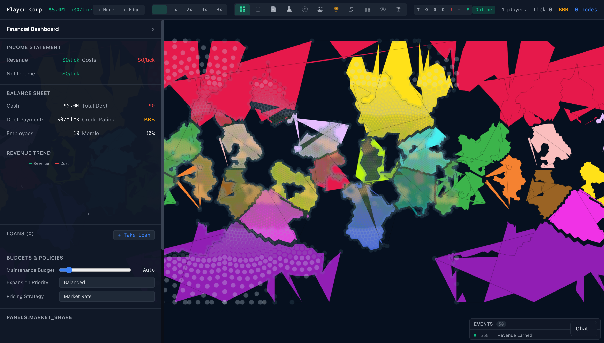
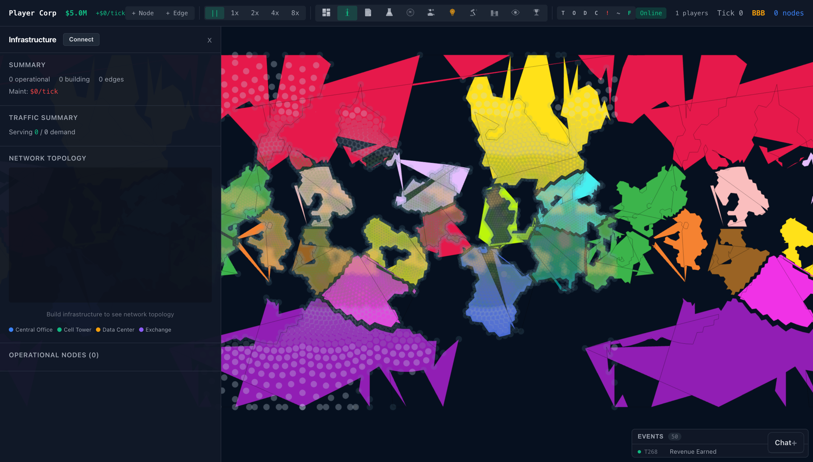
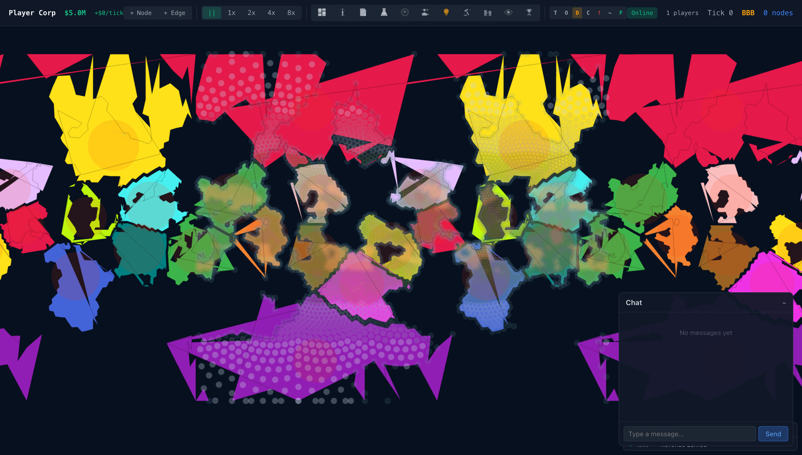
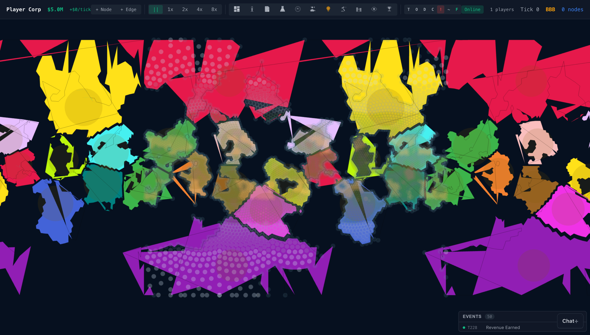
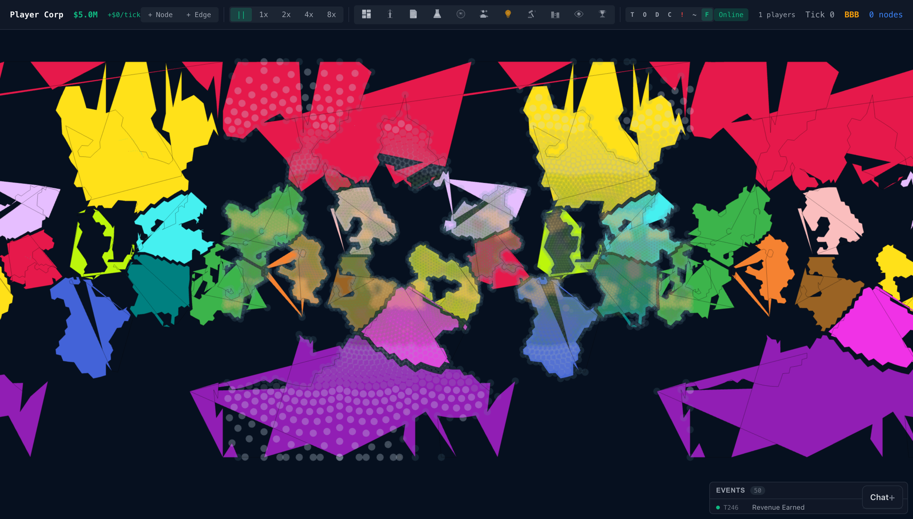
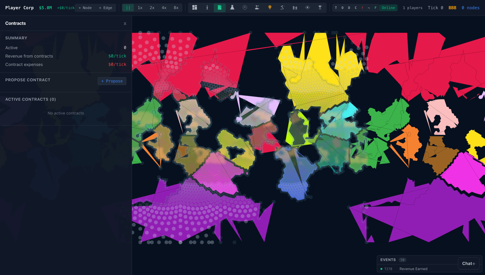
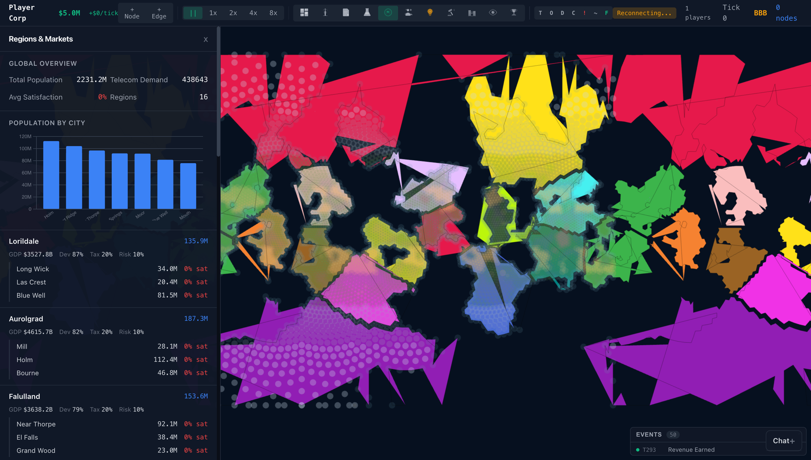
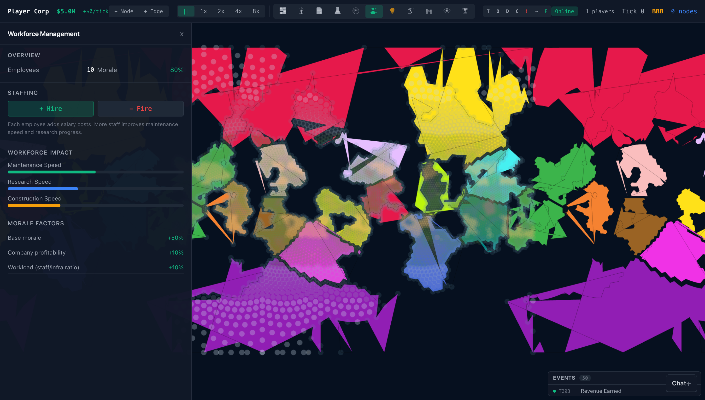
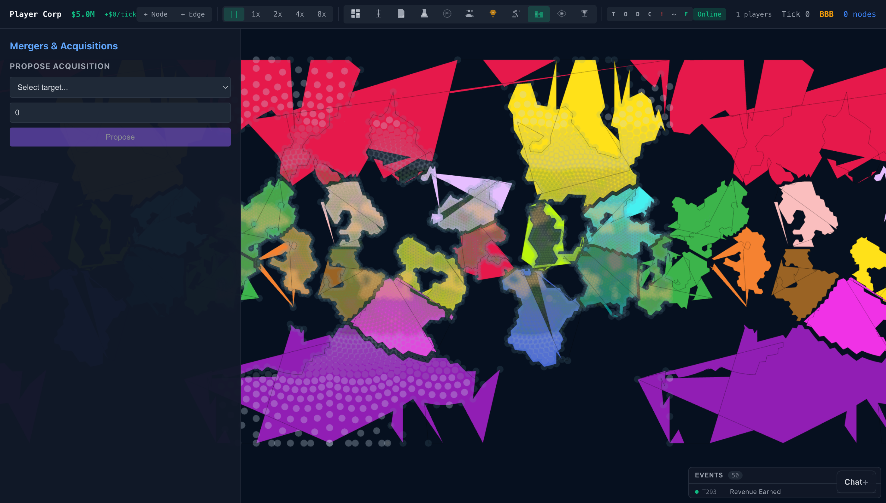

# GlobalTelco

**A 2D infrastructure empire builder.** Build and operate telecom networks on a political map, growing from a local ISP to a global telecom empire.

Mix of city builder, tycoon/business sim, and grand strategy. Web-based with offline single-player and async persistent multiplayer.

> **Live demo:** [globaltelco.online](https://globaltelco.online)


---

## Features

**Infrastructure Empire**
- 51 node types and 28 edge types across 6 technology eras (Telegraph 1850s → Near Future 2030s)
- Full FTTH (Fiber-to-the-Home) game loop: Central Office → Feeder Fiber → Distribution Hub → NAP → Buildings
- Submarine cable system with landing stations, bathymetry routing, and cable ships
- Spectrum management with auctions, carrier aggregation, and interference simulation

**Living World**
- Procedurally generated worlds with Voronoi terrain, rivers, coastlines, and elevation
- Real Earth mode with ESRI satellite tiles, OpenStreetMap roads, and building footprints
- Intra-city street generation (Grid, Radial, Organic, Mixed layouts)
- Dynamic building spawn/destruction based on city population growth
- Weather system with disasters, vulnerability matrix, and insurance

**Business Simulation**
- Per-building subscriber revenue model with competition
- Research tree freely explorable across eras (no era gating)
- Contracts, loans, insurance, mergers & acquisitions
- AI corporations with 4 archetypes that use every game system
- Tiered management: manual at small scale, policy-driven at large scale

**Network Operations**
- Bloomberg Terminal-style network monitoring dashboard
- Bottleneck detection with upgrade suggestions
- SLA monitoring, capacity planning with what-if analysis
- Spectrum interference simulation with spatial indexing

**Build UX**
- Radial/pie build menu with category flyouts
- Catmull-Rom spline cable routing with waypoint editing
- Auto-route along road networks with cost comparison
- Ghost preview with terrain validation and cost-at-cursor
- 9-slot hotbar with keyboard shortcuts (1-9)

**Multiplayer**
- Server-authoritative with WebSocket delta sync (<200ms)
- Optimistic UI with ghost entities
- Speed voting, admin controls, AI proxy for disconnected players
- Anti-cheat: rate limiting, spatial validation, sequence dedup




---

## Tech Stack

| Layer | Technology |
|-------|-----------|
| Simulation | Rust (ECS architecture) → compiles to WASM (browser) + native binary (servers) |
| Frontend | Svelte 5 + deck.gl (2D map) + D3.js (charts) |
| Desktop | Tauri (Rust wrapper, system webview) |
| Server | Rust (Axum) with WebSocket |
| Database | PostgreSQL (Neon) |
| Build | Bun + wasm-pack + cargo-zigbuild |
| Hosting | Oracle Cloud (game server) + Vercel (frontend CDN) + Cloudflare (DNS/proxy) |

---

## Getting Started

### Prerequisites

- [Rust](https://rustup.rs/) (stable)
- [Bun](https://bun.sh/) (v1.0+)
- [wasm-pack](https://rustwasm.github.io/wasm-pack/installer/)

### Development

```bash
# Clone
git clone https://github.com/KodyDennon/GlobalTelco.git
cd GlobalTelco

# Build WASM module
wasm-pack build crates/gt-wasm --target web --out-dir ../../web/src/lib/wasm/pkg

# Install frontend dependencies
cd web && bun install

# Start dev server (hot reload)
bun run dev
```

Open [localhost:5173](http://localhost:5173) — the full game runs in your browser via WASM. No server needed for single-player.

### Build Commands

```bash
# Rust
cargo build                    # Debug build
cargo test                     # Run all tests
cargo build --release          # Release build

# WASM
wasm-pack build crates/gt-wasm --target web --out-dir ../../web/src/lib/wasm/pkg

# Frontend
cd web && bun run dev          # Dev server
cd web && bun run build        # Production build
cd web && bun run check        # TypeScript check

# Desktop (Tauri)
cd desktop && cargo tauri dev  # Dev mode
cd desktop && cargo tauri build # Production build

# Multiplayer server
cargo run --bin gt-server      # Run locally
```

---

## Project Structure

```
globaltelco/
├── crates/                    # Rust workspace (11 crates)
│   ├── gt-common/             # Shared types, traits, protocol (types/ modular directory)
│   ├── gt-simulation/         # Core ECS engine, 36 systems (world/ modular directory)
│   ├── gt-world/              # World generation, terrain, rivers
│   ├── gt-economy/            # Finance, markets, contracts
│   ├── gt-infrastructure/     # Network graph, routing
│   ├── gt-population/         # Demographics, demand
│   ├── gt-ai/                 # AI corporation controllers
│   ├── gt-bridge/             # Shared bridge trait + query functions (WASM & Tauri)
│   ├── gt-wasm/               # WASM bindings (queries, typed arrays, bridge impl)
│   ├── gt-tauri/              # Tauri native bridge (queries, bridge impl)
│   └── gt-server/             # Multiplayer server (routes/, ws/, db/ directories)
├── web/                       # Svelte frontend
│   └── src/lib/
│       ├── wasm/              # TypeScript WASM bridge
│       ├── game/              # Game UI (map, HUD, build tools)
│       ├── panels/            # Management panels (dashboard, infra, etc.)
│       └── stores/            # Svelte stores
├── desktop/                   # Tauri desktop app
├── deploy/                    # Server deployment scripts
├── Docs/                      # Design documents
└── screenshots/               # Game screenshots
```

---

## Architecture

**Single-player:** The Rust simulation compiles to WASM and runs entirely in the browser. No server needed.

**Multiplayer:** Server-authoritative. Clients send commands via WebSocket, the server validates and broadcasts state deltas to all players.

**ECS tick order (36 deterministic systems):**
construction → orbital → satellite_network → maintenance → population → coverage → demand → routing → utilization → spectrum → ftth → manufacturing → launch → terminal_distribution → satellite_revenue → revenue → cost → finance → contract → ai → weather → disaster → debris → servicing → regulation → research → patent → market → auction → covert_ops → lobbying → alliance → legal → grants → achievement → stock_market

See [Docs/](Docs/) for full design specifications.

---

## Screenshots

<details>
<summary>Click to expand all screenshots</summary>

| | |
|---|---|
|  |  |
|  |  |
|  |  |
|  |  |
|  |  |
|  |  |
|  |  |
|  |  |
|  |  |

</details>

---

## Contributing

See [CONTRIBUTING.md](CONTRIBUTING.md) for guidelines. Contributions are welcome — the project uses a contributor license (see [LICENSE](LICENSE) Section 4).

---

## Credits

**Developed by:** Claude Opus 4.5 & 4.6, Claude Sonnet 4.5 & 4.6, Gemini Pro 3.0, Gemini Flash

**Orchestrated by:** Kody Dennon

---

## License

This project uses a custom **Source Available** license. You are free to clone, modify, build, run, and self-host for non-commercial purposes. Commercial use requires written permission.

See [LICENSE](LICENSE) for full terms.
